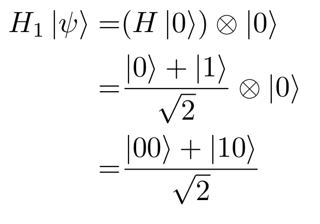
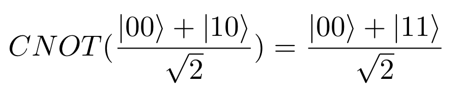
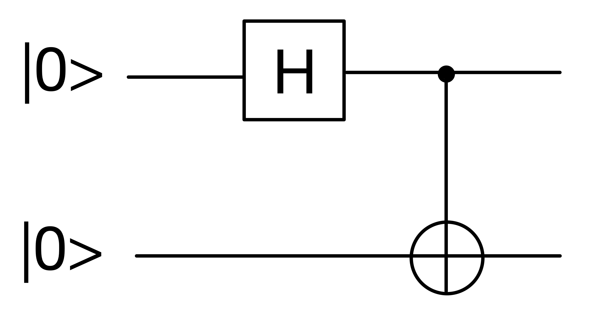

# A Simple Simulation of Quantum Encrypted Communication with Q# using One-Time Pad

## Requirement
1. Install the latest version of the [.NET Core SDK](https://dotnet.microsoft.com)
2. Install `IQSharp` by running `dotnet tool install -g Microsoft.Quantum.IQSharp`
3. Install kernel spec `dotnet iqsharp install`
4. Use python version >= 3.6
5. Install python package `pip3 install qsharp`
6. Start the program by running `python3 quantum_encrypted_communication.py`

## Description
This is a simulation of quantum encrypted communication with Q# using one-time pad encryption. Alice takes a message and breaks it into characters, for each character it is turned into an 8-bit binary form using ascii encoding. Then we entangle 8 pairs of Qubits in bell states and distribute each of the entagled Qubits to Alice And Bob. When Alice measures all 8 of her Qubits, she collapses them into |0> or |1>, because her Qubits are entangled with Bob's Qubits, Bob's Qubits will collapse into the same states. Then Alice uses the collapsed states as the encryption key. She takes the 8-bit binary form of the character and perform XOR operation with the 8-bit collapsed Qubits. Then she sends the encrypted binary to Bob, Bob will in turn use his measurements of his Qubits, which should be identical to Alice's measurements, to perfrom XOR with the encrypted binary he received, the result should be the unencrypted 8-bit binary of the character.

### Qubits Entanglement
We want to entangle two Qubits in bell state, which has 50% chance of collapsing into |00> and 50% chance into |11> upon measurement. So that when we measure Alice's Qubit and find it in |0>, we know that Bob's qubit is also in |0>. And when we find Alice's Qubit in |1>, we know that Bob's qubit is also in |1>.
  
  

  
To do so we first prepare two Qubits in |0>, then we apply Hadamard Gate to the first Qubit to turn it into a superposition.
 

  
Then we apply CNOT Gate where the first Qubit is control and the second Qubit is target, so that when the first Qubit is in state |1>, the NOT Gate is applied to the second Qubit. Applying this to the superposition above we get the bell state.
 

 
  

### One-Time Pad
The one-time pad encryption method simply takes a plain text message and perform XOR (exclusive OR) with an encryption key. The encrypted message could simply be deciphered by performing XOR with the same encryption key. One-Time Pad is proven to be unbreakable if:

* The key is the same length of the message
* The key is truly randomly genereated
* The key is only used once

In our simulation, the key is generated by measuring Qubits in bell states, which has 50% chance of collapsing into |0> or |1>, which is truly random. For each character we use 8 collapsed Qubits which is the same length of the character. We repeat the process for each character so the key is only used once.

#### XOR Example
Exclusive OR means it only outputs true when the 2 bits are different, otherwise it's false.
<pre>
Unencrypted: 01010110
Key:         00111110 XOR
Encrypted:   01101000

Encrypted:   01101000
Key:         00111110 XOR
Unencrypted: 01010110
</pre>